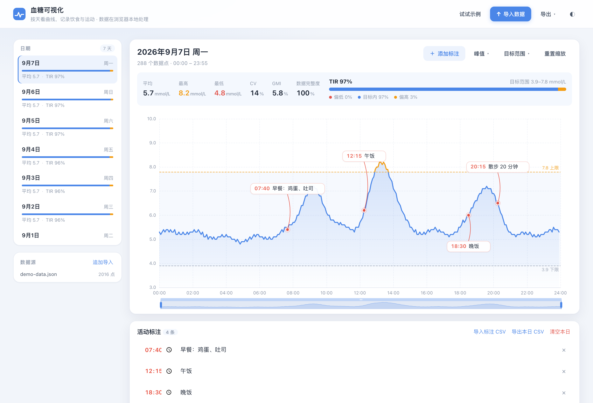

# 血糖可视化 · 网页版

把导出的血糖数据拖进浏览器，就能按天查看曲线、随手加标注。
目前支持欧态 App 导出格式，后续计划逐步适配更多厂商。仓库名保持不变。
**纯前端、无后端、无上传**：所有解析、绘图、保存都在你自己的浏览器里完成。

> 在线使用：<https://zzsqwq.github.io/OttaiCGM-Visualizer-Web/>
> 原来的 Python 脚本版在 <https://github.com/zzsqwq/OttaiGCM-Visualizer>



<sub>深色主题与移动端效果见 [docs/](docs/)</sub>

## 能做什么

- **导入**：拖入欧态 App 导出的 `.xlsx`（「时刻」+「血糖值mmol/L」两列），也支持 `.csv` / `.json`；可以一次选多个文件，自动合并去重
- **按天拆分**：左侧列出所有日期，点一下切换；键盘 `←` `→` 也能翻
- **自由标注**：点「添加标注」后在曲线上点一下就能记录饮食/运动/感受
  - 拖标签上下移动 → 调整位置，避开曲线
  - 拖曲线上的小圆点左右移动 → 改时间
  - 双击文字 → 直接改；`Delete` 删除；`Cmd/Ctrl+Z` 撤销
- **峰值检测**：算法与原来 Python 脚本里的 `scipy.signal.find_peaks` 一致，可调「最小间隔」「最小突出度」
- **统计**：平均 / 最高 / 最低 / CV / GMI / 数据完整度 / TIR-TAR-TBR 分布
- **目标范围可调**：默认 3.9–7.8 mmol/L，改了之后曲线的颜色分界、统计口径都会跟着变
- **导入旧标注**：原来 `annotations-*.csv`（`时间,活动描述,Y偏移量,日期`）可以直接拖进来
- **导出**：当前日图片（含标注）、标注 CSV（与旧脚本格式互通）、血糖数据 CSV、完整 JSON 备份
- **本地保存**：刷新或关掉页面再打开，数据和标注都还在（localStorage）

## 本地运行

```bash
cd web
pnpm install          # 也可以用 npm install
pnpm dev              # http://127.0.0.1:5173
```

构建与预览：

```bash
pnpm build            # 输出到 web/dist（纯静态文件）
pnpm preview          # 本地起一个静态服务器预览构建结果
```

想要「一个 HTML 文件、双击就能用」的版本：

```bash
pnpm build:single     # 输出 web/dist-single/index.html（约 1 MB，JS/CSS 全部内联）
```

浏览器不允许 `file://` 页面加载 ES 模块，所以普通的 `dist/index.html` **必须挂在静态服务器上**
（`pnpm preview`、`cd dist && python3 -m http.server` 都行）。`build:single` 生成的单文件版本
则可以直接双击打开：导入数据、加标注、本地保存、导出都正常，只有「试试示例」需要联网/服务器支持。

## 部署

`pnpm build` 之后的 `web/dist` 就是一个纯静态站点，扔到任何静态托管都行：

- **GitHub Pages**：仓库里带了 [`.github/workflows/deploy-web.yml`](.github/workflows/deploy-web.yml)，
  推送到 `master` 就会自动跑「类型检查 → 单元测试 → 构建 → 发布」；
  首次运行会用 `enablement: true` 自动把 Pages 打开（也可手动在 Settings → Pages 里把 Source 选成 GitHub Actions）
- **其他地方**：Vercel / Netlify / Cloudflare Pages / 自己的服务器，构建命令 `pnpm build`，产物目录 `dist`
  （`vite.config.ts` 里 `base: './'`，放在子路径下也不会白屏）

## 数据存在哪里

用浏览器自带的 `localStorage`，两个键：

| 键 | 内容 |
| --- | --- |
| `ottai-cgm:workspace:v1` | 血糖数据（按天压成 `[分钟, 数值, ...]`）、标注、数据源、上次看的那一天 |
| `ottai-cgm:settings:v1` | 主题、目标范围、峰值参数 |

行为：

- 每次改动后 500ms 防抖写入，关闭页面前再补一次
- 下次打开自动恢复，并**回到上次看的那一天**
- 实测 15 天 / 4021 个血糖点 + 1 条标注 ≈ **32 KB 字符**（约 2.2 KB/天）；
  一年数据约 1.6 MB，浏览器配额通常 5 MB，够用
- 万一超出配额：自动降级为「**只保存标注**」（手写的内容优先保住），界面提示导出 JSON 备份；
  引导页会显示「本地还保存着 N 条标注，导入对应血糖文件后就会自动出现」

会丢数据的情况：清理浏览器数据 / 无痕模式 / 换浏览器 / **换访问地址**（`http://127.0.0.1:5173`、
`http://127.0.0.1:4173`、GitHub Pages 域名是三个互不相通的存储空间）。
要跨设备或长期留存，用「导出 → 备份全部数据 (JSON)」，换台电脑「从 JSON 恢复」即可。

## 支持的输入格式

当前已适配的厂商格式为欧态 App 导出文件；也可导入本工具导出的血糖 CSV 和 JSON 备份。
其他厂商格式待适配。以下是当前解析器识别的表头、单位和时间写法：

| 情况 | 说明 |
| --- | --- |
| 欧态 App 导出 | `时刻` / `血糖值mmol/L`，值为字符串如 `2025.3.20 01:45`、`6.6` |
| CSV | `日期,时间,血糖值mmol/L` 或 `时刻,血糖值` |
| 单位 | 写了 `mg/dL` 或数值中位数明显偏大时自动换算成 mmol/L |
| 编码 | UTF-8 / GBK 都能读 |
| 时间 | `2025.3.20 01:45`、`2025-03-20 01:45`、Excel 日期序列号、纯时间 + 日期列 |

标注 CSV（可直接复用旧脚本的格式）：

```csv
时间,活动描述,Y偏移量,日期(可选)
12:10,吃饭15分钟，紫米+香干炒肉+番茄炒蛋,0.8,2025/3/17
18:40,散步15min,-0.7,2025/3/17
```

没有日期列时，会用文件名里的日期（如 `annotations-20250317.csv` → 2025-03-17）。

## 开发

```bash
pnpm typecheck        # TypeScript 类型检查
pnpm test             # 单元测试（vitest，含与 scipy / openpyxl 的基准比对）
pnpm build            # 类型检查 + 打包
pnpm build:single     # 打包成单个 HTML 文件
pnpm smoke            # 真实 Chrome 端到端冒烟测试（需先 pnpm build + pnpm preview）
pnpm reference        # 重新生成峰值检测的测试基准（需要本地有 scipy / numpy / openpyxl）
```

> `pnpm smoke` 需要本机装了 Chrome；不是默认安装路径时用 `CHROME_PATH=/path/to/chrome pnpm smoke` 指定。

`pnpm smoke` 会自己拉起 headless Chrome，跑一遍「示例数据 → 导入真实 xlsx → 追加导入 →
导入标注 CSV → 手动加标注 → 拖动 → 撤销 → 峰值 → 缩放 → 刷新恢复 → 深色主题 → 移动端 → 导出 PNG」，
截图落在 `.screenshots/`（已在 .gitignore 里）。`docs/` 下的 README 配图由
`node scripts/screenshots.mjs` 生成。

性能回归用 `node scripts/bench-ui.mjs`（会自己造一年的合成数据，测量切日期 / 选标注 / 鼠标扫图
的主线程耗时）。当前参考值（一年 10.5 万点）：切日期约 11ms、选标注约 1.7ms、鼠标扫图约 3.8ms 每次。

两个和渲染性能有关的开关：

- 图表默认关闭 ECharts 的 `useDirtyRect`（只重绘变化区域）。开启时在平移/提示框连续重绘的
  场景下，面积填充会留下没被补回来的竖条；加 `?dirtyrect=1` 可以打开它做对比。
- 面积填充用纯色而不是纵向渐变：渐变每帧要逐像素求值，实测每次重绘贵约 27%，两者视觉差异约 0.5%。

目录结构：

```
src/
├── core/            纯逻辑，不依赖 DOM，可直接跑单元测试
│   ├── parser.ts    导入解析：xlsx / csv / json / 旧标注 CSV
│   ├── series.ts    按天分组、阈值切分、缺口处理
│   ├── peaks.ts     scipy.signal.find_peaks 的 TypeScript 实现
│   ├── stats.ts     TIR / TAR / TBR / CV / GMI
│   └── time.ts      墙上时间解析与格式化（不涉及时区换算）
├── chart/
│   ├── dayChart.ts  ECharts 图表（曲线 + 参考范围 + 峰值）
│   └── overlay.ts   标注层：DOM 标签 + SVG 引线，可拖动、可编辑
├── state/           状态与本地持久化
├── io/              导入导出（CSV / JSON / PNG 合成）
└── ui/              界面装配
```

### 一些实现上的选择

- **时间用「墙上时间」而不是时间戳**：欧态导出的时间没有时区信息，用 `(日期, 当天分钟数)`
  表示可以完全避开时区/夏令时带来的偏移，跨天分割也天然准确
- **曲线在 7.8 处精确变色**：在线段与阈值相交的位置插入交点，交给 ECharts 的 `visualMap` 分段上色，
  所以颜色分界正好落在参考线上，而不是落在某个采样点上
- **标注不用 canvas 画**：标签是普通 DOM、引线是 SVG，所以拖动、双击改字、删除都是原生交互；
  导出图片时再用这套布局信息画到 canvas 上，保证图片和屏幕一致
- **数据不出浏览器**：没有后端、没有请求，换台电脑就只能靠导出的 JSON 备份

### 峰值检测的一致性

`src/core/peaks.ts` 是 scipy `find_peaks` 的移植，用真实血糖数据比对过：

- 局部极大值、prominence：与 scipy 完全一致
- distance 过滤：**96 组参数里 77 组逐位相同**；其余差异只出现在「峰高完全相同、
  且互相落在最小间隔窗口内」的情况下（scipy 内部用 numpy 不稳定排序决定留谁），
  选哪个都不影响解读

基准数据由 `pnpm reference`（需要本地 scipy）生成，产物是 `test/fixtures/reference.json`，
单元测试直接拿它比对，所以**没有 scipy 的环境也能跑测试**。
